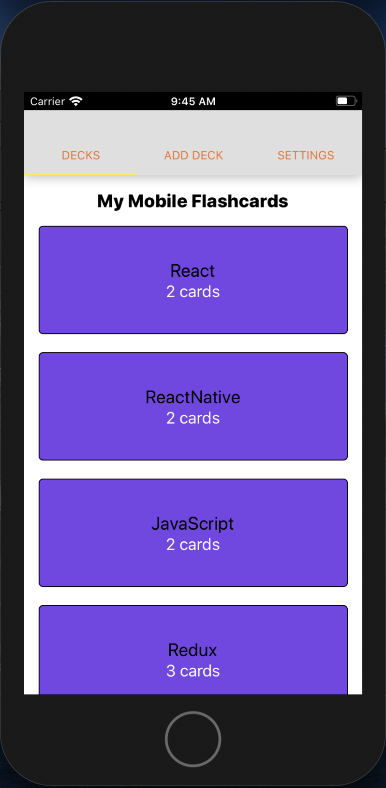
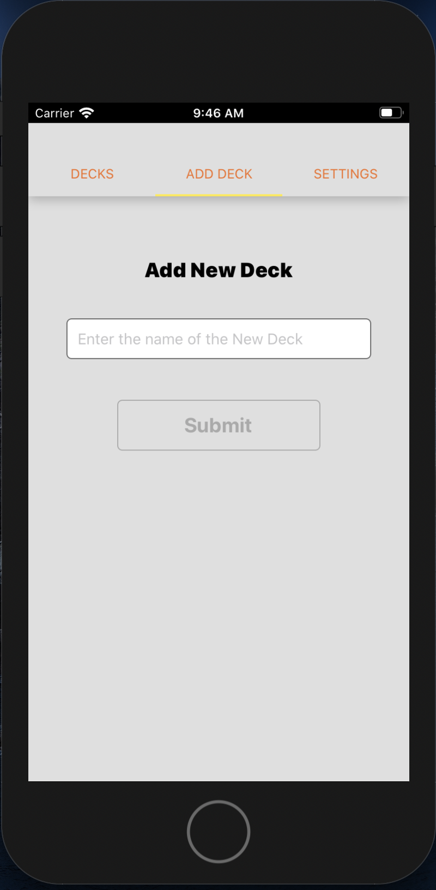
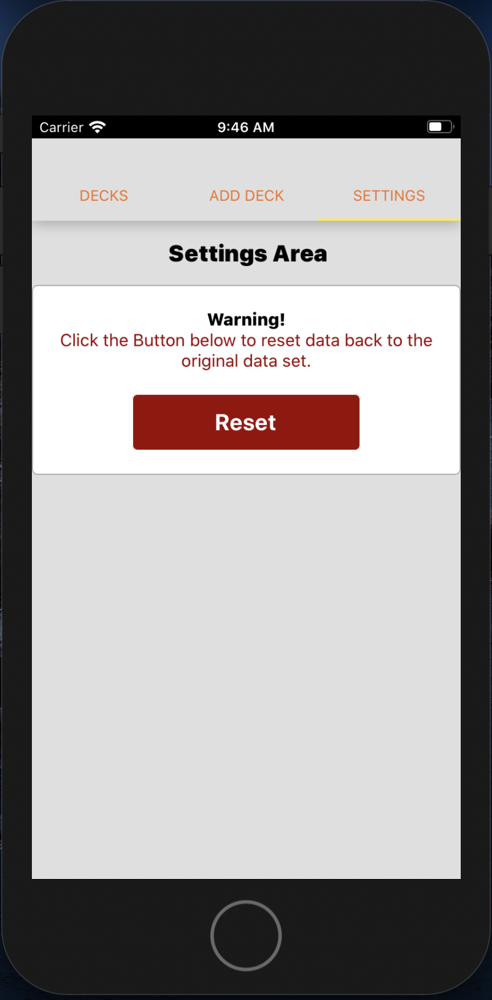
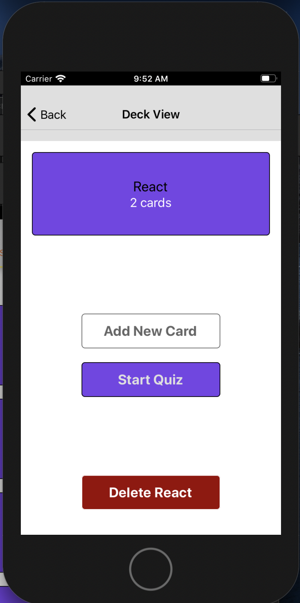

# Mobile Flashcards

Mobile Flashcards is a React Native app for iOS and Android that allows users to create flashcard decks, that they can add cards to and quiz themselves.

No. | #1 | #2 | #3 | #4 | 
--- | --- | --- | --- |--- |
Image |  |  |  |  | 

## Installation

Clone the repository, change directories, and use npm or yarn to install the dependencies.

```bash
$ git clone https://github.com/AmosWels/my-mobile-flashcards.git
$ cd my-mobile-flashcards
$ npm install
$ yarn start or npm start
```

## Usage or How to test it out
- After cloning the application, ensure that you have all the dependencies installed and next would be running the applocation.

- The application can be executed on both ios and andriod platforms. 
    - Use an Android Emulator or iOS Simulator to run the app: below are the respective links
    - [iOS Simulator Setup](https://docs.expo.io/versions/v33.0.0/introduction/installation/#ios-simulator)
    - [Android Emulator Setup](https://docs.expo.io/versions/v33.0.0/introduction/installation/#android-emulator)

### Troubleshooting any simulator issues
- Ensure that you have the right environment set up e.g for my case, i required a later operating system i.e Mac Os catalina 10.15.6 and XCode version 11+. 

- This is what i've learnt and found easy to do after having issues with simulators in the beginning, just install expo on each of your devices and connect to the same network as the host machine.

- After installing the expo app, you can spin up a dev server from any device (or OS) and start working on it. 

- Alternatively, you can use the web version of expo to develop. To do that you can execute ```expo start --web```. This runs the simulator on your browser itself without requiring any additional dependency.

The project can be run with npm or yarn

- `npm start` 

This will open Expo Developer Tools in the browser on localhost e.g - ```http://localhost:19002/```

- Use your device with expo installed to test out the application:

  ([Expo Client for Android & iOS](https://expo.io/tools#client)) Scan the QR Code using the Expo Client app from an Android or iOS device.

